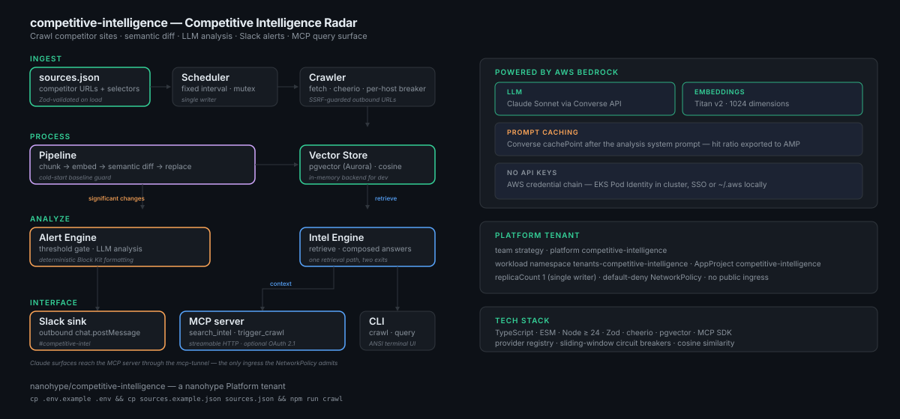

# competitive-intelligence


A competitive-intelligence radar. It crawls competitor websites on an interval, embeds the content, and **semantic-diffs** each page against its own history using embedding cosine similarity — not text comparison — so only meaningfully new content counts as a change. When a page's change score clears the significance threshold, an LLM analyzes the new content (summary + significance + extracted signals) and fires a Slack alert. Accumulated intelligence is queryable over Slack and the CLI.

**AI clients / agents start here:** [`AGENTS.md`](AGENTS.md). For the stack-wide view, see the [Platform Reference](https://github.com/nanohype/nanohype/blob/main/docs/platform-reference.md).

> The Slack slash command is `/competitive-intelligence`; the default alert channel is `#competitive-intel` (a short handle the team watches).

## What it is

A radar that watches competitor marketing, docs, and pricing pages and tells you when something actually changed. The trick is the diff: each page is chunked and embedded, and a chunk only counts as "new" when its cosine similarity to the best stored match for that source falls below 0.85. A reworded paragraph or a reordered nav doesn't fire; a new enterprise tier or a deprecated API does. Above-threshold changes get an LLM analysis and a Slack alert; the accumulated history answers ad-hoc questions (`/competitive-intelligence query …`).

History is durable — embeddings live in pgvector (Aurora), so a pod restart or rollout diffs the next crawl against real history instead of re-flagging every page as new. A cold-start guard backs that up: the first crawl of any unseeded source is treated as baseline seeding (ingest + embed, no alerts). Bedrock (Claude Sonnet via Converse for analysis, Titan v2 for embeddings) is the default and runs on-account via EKS Pod Identity — no keys; Anthropic and OpenAI are pluggable alternates. See [`ARCHITECTURE.md`](ARCHITECTURE.md) for the bounded contexts, the crawl→alert data flow, and the load-bearing decisions.



## Quickstart

```bash
npm install
cp .env.example .env             # fill in values — see CLAUDE.md > Configuration
cp sources.example.json sources.json
npm run dev                      # tsx watch src/index.ts — scheduler + Slack bot + /health on :3000
```

Local dev defaults to `VECTOR_PROVIDER=memory` (no database). To exercise durable history, point `VECTOR_PROVIDER=pgvector` + `DATABASE_URL` at a Postgres with the `vector` extension. Without Slack:

```bash
npm run crawl                    # one-off crawl + diff + alert
npm run query -- "Who launched new AI features?"
```

Run the full local gate before pushing:

```bash
task ci   # build + lint + typecheck + format:check + test + helm lint/template + docker build
```

## Bedrock prerequisites

Bedrock is the default for both LLM and embeddings and runs on the AWS credential chain — no API keys. On the cluster that chain resolves to the pod's IAM role via EKS Pod Identity; locally it resolves to your `~/.aws` credentials or SSO. Confirm `aws sts get-caller-identity` works, and enable model access for the configured `BEDROCK_LLM_MODEL` (default `us.anthropic.claude-sonnet-4-20250514-v1:0`) and `amazon.titan-embed-text-v2:0` in the [Bedrock console](https://console.aws.amazon.com/bedrock/home#/modelaccess) for your region. To use a direct API provider instead, set `LLM_PROVIDER` / `EMBEDDING_PROVIDER` and the matching key.

## Sources

Monitored pages live in `sources.json` (validated with Zod on load; `sources.example.json` is a starter set of AI-SaaS competitor pages). Each entry:

```json
{
  "competitor": "aws",
  "url": "https://aws.amazon.com/new/",
  "type": "changelog",
  "selectors": { "content": "main", "exclude": ["nav", "footer", "#aws-page-header"] }
}
```

`type` is one of `changelog` / `blog` / `pricing` / `careers` / `docs` / `general`. `selectors.content` scopes the main content region (defaults to `body`); `selectors.exclude` strips nav/footer/ads. The per-source history key is `id`, which defaults to `<competitor>:<type>` — set it explicitly to monitor two same-type pages for one competitor. The fetcher is static HTML; JS-rendered SPAs return little content. Selectors track each site's markup, so a competitor redesign may need an update.

## Slack

Slack is optional — the CLI works without it. To enable: create a Slack app, add bot scopes (`app_mentions:read`, `chat:write`, `commands`, `im:history`, `im:read`, `im:write`), subscribe to `app_mention` + `message.im` events, register the `/competitive-intelligence` slash command, and (for Socket Mode) generate an app-level token with `connections:write`. Then set `SLACK_BOT_TOKEN`, `SLACK_SIGNING_SECRET`, and `SLACK_APP_TOKEN`. If `SLACK_APP_TOKEN` is set the bot runs in Socket Mode (no public URL); otherwise it listens for HTTP events on `PORT`.

| Command                                      | Description                     |
| -------------------------------------------- | ------------------------------- |
| `/competitive-intelligence query <question>` | Ask about competitors           |
| `/competitive-intelligence crawl`            | Trigger an immediate crawl      |
| `/competitive-intelligence status`           | Show system uptime and health   |
| `@<bot> <question>`                          | Ask via @mention in any channel |

## Deploy

Ships as a [`eks-agent-platform`](https://github.com/nanohype/eks-agent-platform) Platform tenant. The trio:

- **`chart/`** — the application Helm chart: Deployment (`replicaCount: 1`, single-writer crawl mutex) + Service (`/health`+`/readyz`) + NetworkPolicy (default-deny + egress allow-list, IMDS blocked, no public ingress) + ServiceAccount (Pod Identity) + ExternalSecret (ESO), plus PrometheusRule alerts and a Grafana dashboard. Per-env deltas in `chart/values-{dev,staging,production}.yaml`.
- **`platform.yaml`** — the `Platform` CR + `BudgetPolicy` declaring the tenant boundary (`tenant: protohype`, namespace `tenants-protohype`, project `tenant-protohype`). The operator reconciles the Namespace, ResourceQuota, NetworkPolicy, and ArgoCD AppProject.
- **`gitops/applicationset-entry.yaml`** — the ApplicationSet entry registered into [`nanohype/eks-gitops`](https://github.com/nanohype/eks-gitops) for ArgoCD reconciliation.

The AWS substrate — Aurora Serverless v2 (pgvector), the IAM role, and Secrets Manager seeding — is provisioned by the `competitive-intelligence-platform` component in [`landing-zone`](https://github.com/nanohype/landing-zone). It binds the role to the chart's ServiceAccount with an EKS Pod Identity association; the Aurora endpoint feeds `tenantInfra.*`. Apply `platform.yaml` once, wait for `Ready`, then ArgoCD owns the rollout: bump `image.tag` in the per-env values, commit, push.

## Boundaries

This repo owns the application — the crawler, the semantic-diff pipeline, the alert + intel engines, the Slack surface, and the tenant trio that deploys it. It does **not** own:

- AWS substrate (Aurora/pgvector, the IAM role, Secrets Manager seeding) → the `competitive-intelligence-platform` component in [`landing-zone`](https://github.com/nanohype/landing-zone)
- Cluster addons (external-secrets, the OTel collector + log forwarder, kube-prometheus-stack) → [`eks-gitops`](https://github.com/nanohype/eks-gitops)

## Configuration

All config via env vars, validated by Zod in `src/config.ts` — see [`CLAUDE.md`](CLAUDE.md) § Configuration for the full inventory. In-cluster, secret values come from AWS Secrets Manager (`competitive-intelligence/<env>/*`) via the chart's ExternalSecret; `.env.example` is for local dev only.

## License

Apache-2.0.
